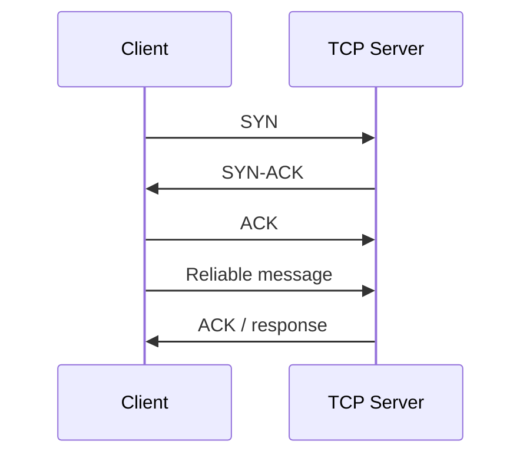

# TCP Architecture

## Flow

## Key Properties

- Connection-oriented communication
- Ordered delivery
- Retransmission on packet loss
- Flow control and acknowledgement tracking

## Lab Mapping

- The TCP messaging exercise uses one persistent socket per client.
- The server logs username, connection time, message body, and disconnection time.
