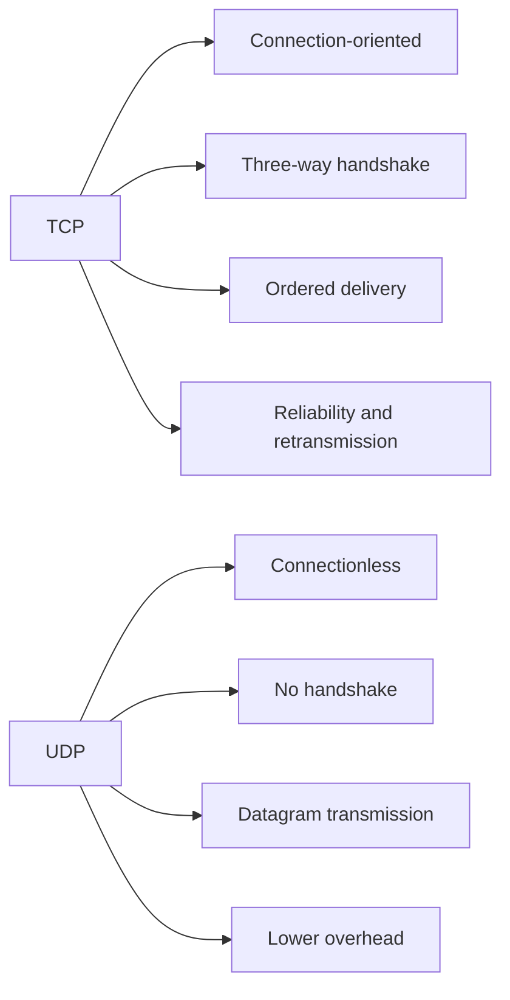

# TCP vs UDP Mermaid Comparison

## Quick Takeaway

- Use TCP when delivery correctness matters more than raw speed.
- Use UDP when low latency and lightweight transmission matter more than guaranteed delivery.
