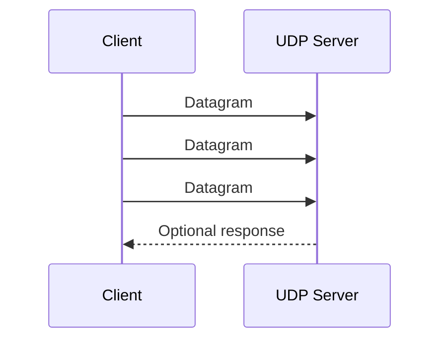

# UDP Architecture

## Flow

## Key Properties

- Connectionless communication
- No handshake
- Datagram-based transmission
- Best-effort delivery without retransmission guarantees

## Lab Mapping

- The UDP analyzer receives each packet independently.
- Packet metadata is displayed for monitoring and troubleshooting.
