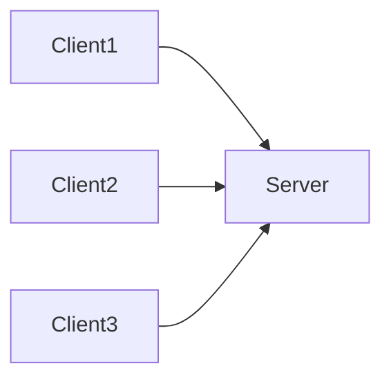

# Mermaid Diagrams

See `socket-lifecycle.md` and `echo-server-architecture.md` for visualizations.

Multi-client example:

```mermaid
graph LR
    Client1 --> Server
    Client2 --> Server
    Client3 --> Server
```
