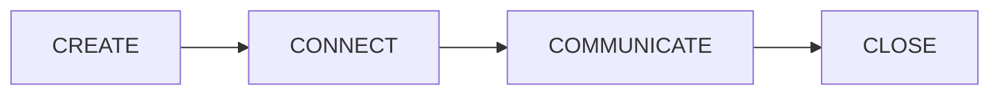

# Socket Lifecycle

```mermaid
graph LR
    CREATE[CREATE] --> CONNECT[CONNECT]
    CONNECT --> COMMUNICATE[COMMUNICATE]
    COMMUNICATE --> CLOSE[CLOSE]
```

Each stage maps to code: creating `ServerSocket`, `Socket` connect, reading/writing, and closing resources.
