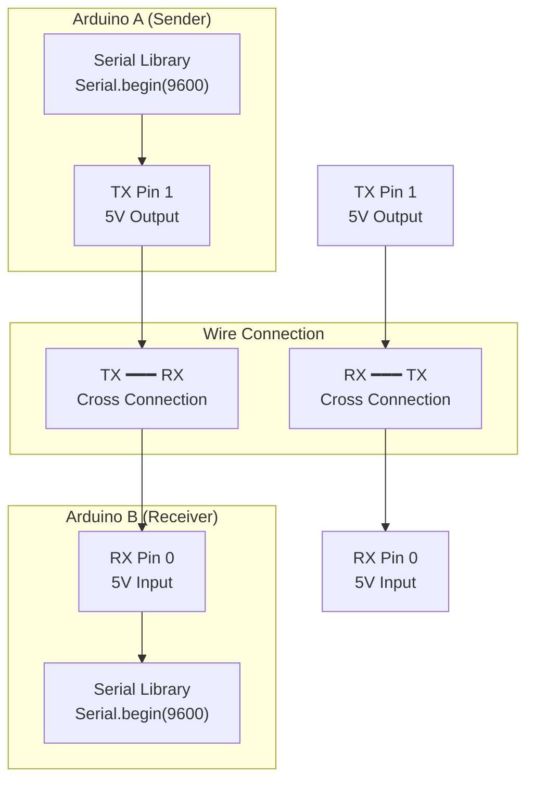

# Arduino-to-Arduino UART Communication

## Architecture Overview



## Physical Wiring

```
Arduino A (Sender)              Arduino B (Receiver)
┌─────────────────────────┐    ┌─────────────────────────┐
│   Pin 0 (RX)  ←━━━━━━━━┼━━━━┼━ Pin 1 (TX)             │
│   Pin 1 (TX)  ━━━━━━━━┼━━━━┼→ Pin 0 (RX)             │
│   GND ────────━━━━━━━━┼━━━━┼─ GND (CRITICAL)         │
│                        │    │                         │
│   (5V, 16 MHz)         │    │   (5V, 16 MHz)         │
└─────────────────────────┘    └─────────────────────────┘
         │                                │
     [USB Cable]                      [USB Cable]
    (Programming &              (Programming &
     Monitoring)                Monitoring)
```

## Communication Flow

```
Time    Arduino A               Arduino B
────────────────────────────────────────────
0       [startup]
        Initializes Serial @ 9600 baud
                                [startup]
                                Initializes Serial @ 9600 baud
                                Waits for incoming data

~1 sec  Sends: "Message #1\n"
        TX pin outputs data bits
        ────────────────────────────→
                                Receives 10 bits/character
                                Reconstructs "M", "e", "s", ...
                                Buffer: "Message #1\n"
                                Detects newline delimiter
                                Processes complete message
                                Displays on Serial Monitor

~2 sec  Sends: "Message #2\n"
        ────────────────────────────→
                                Receives and processes

~3 sec  Sends: "Message #3\n"
        ────────────────────────────→
                                Receives and processes
```

## Timing Diagram at 9600 Baud

Message: "Message #1\n" (11 characters)

```
Arduino A TX:
Time    0 ms    1 ms    2 ms    3 ms    4 ms    5 ms    6 ms    7 ms    8 ms    9 ms   10 ms   11 ms
        │───M───│───e───│───s───│───s───│───a───│───g───│───e───│─── SP──│───#───│───1───│───\n──│
        └─────────────────────────────────────────────────────────────────────────────────────────┘
              Total: ~11.5 ms to transmit entire message

Arduino B RX:
        ├────────────────────────────────────────────────────────────────────────────────────────┤
        │ Continuously samples RX pin at 9600 baud rate                                          │
        │ Reconstructs each character from 10 bits                                               │
        │ Buffers all 11 characters                                                              │
        │ Detects newline ('\n')                                                                 │
        │ Application receives: "Message #1"                                                     │
        └────────────────────────────────────────────────────────────────────────────────────────┘
```

## Serial Monitor Display

### Arduino A (Sender)
```
=== Sender ===
[1000 ms] Message #1
[2000 ms] Message #2
[3000 ms] Message #3
```

### Arduino B (Receiver)
```
=== Receiver ===
[1010 ms] Received: Message #1
[2010 ms] Received: Message #2
[3010 ms] Received: Message #3
```

## Critical Requirements

| Requirement | Why | Impact |
| --- | --- | --- |
| Cross-wired TX/RX | TX sends, RX receives | Parallel wiring = no communication |
| Common GND | Reference voltage | Garbled data or no reception |
| Same baud rate | Synchronization | Garbled text if mismatch |
| Correct pins | Hardware | Different pins = no effect |
| USB isolation | Power safety | Required for direct connection |

## Limitations & Constraints

1. **Single UART**: Arduino UNO has only one hardware UART (pins 0/1)
   - Cannot simultaneously send and receive large amounts of data
   - Solution: Implement careful timing or use SoftwareSerial (slower)

2. **Baud Rate**: Limited to standard rates (9600, 19200, 38400, 57600, 115200)
   - Cannot use arbitrary rates
   - 9600 is safest for long cables

3. **Distance**: Reliable up to ~10-15 meters (depending on baud rate and environment)
   - Longer distances need RS-485 or fiber optic

4. **Noise Immunity**: Direct connection susceptible to EMI
   - Twisted pair wires recommended
   - Ferrite cores can help

## Advantages

| Aspect | Benefit |
| --- | --- |
| **Simplicity** | Only 3 wires (TX, RX, GND) |
| **Standard** | Universal interface on almost all microcontrollers |
| **Low Cost** | No additional hardware needed |
| **Debugging** | Built-in Serial Monitor in Arduino IDE |
| **Educational** | Easy to understand and verify |

## Disadvantages

| Aspect | Limitation |
| --- | --- |
| **Single Channel** | Only one direction at a time (half-duplex practical limitation) |
| **No Error Detection** | Garbled data passes through silently |
| **No Flow Control** | If receiver buffer fills, data is lost |
| **No Synchronization** | If baud rates mismatch, complete failure |
| **Limited Distance** | ~15 meters max without level shifting |

## Hardware Considerations

### Voltage Levels
- **Arduino UNO**: 5V logic (HIGH = 5V, LOW = 0V)
- **ESP32**: 3.3V logic (HIGH = 3.3V, LOW = 0V)
- **Arduino to Arduino**: Compatible (both 5V)

### Pin Characteristics
| Aspect | TX Pin | RX Pin |
| --- | --- | --- |
| **Direction** | Output | Input |
| **Drive Strength** | High (~40 mA) | Moderate (~20 mA) |
| **Idle State** | HIGH (5V) | Samples |
| **Swappable** | No | No (fixed by hardware) |

## Real-World Example

Typical Arduino-to-Arduino setup:

```
Arduino A                        Arduino B
(Master Data Logger)             (Sensor Node)
┌──────────────────┐            ┌──────────────────┐
│ Collects data    │            │ Periodically     │
│ from sensors     │            │ sends data       │
│                  │            │                  │
│ Requests: "GET"  │━━━━━━━━━━━→│ Receives: "GET"  │
│                  │            │ Sends: "TEMP=25" │
│ Receives: data   │←━━━━━━━━━━┤ Transmits        │
│ Logs to SD card  │            │                  │
└──────────────────┘            └──────────────────┘
```

## Testing Connectivity

### Loopback Test
Connect TX pin to RX pin on same Arduino:

```cpp
void setup() {
  Serial.begin(9600);
}

void loop() {
  Serial.println("Hello");
  delay(1000);
  if (Serial.available()) {
    char c = Serial.read();
    Serial.println(c);  // Should echo "H"
  }
}
```

Result: Arduino receives its own transmission (confirms UART hardware works)

## See Also

- [Exercise 02 - Arduino-to-Arduino UART](../../Exercise-02-Arduino-to-Arduino-UART/)
- [UART Frame Structure](uart-frame-structure.md)
- [Advanced Topics: Baud Rate Mismatch](uart-advanced-topics.md)
