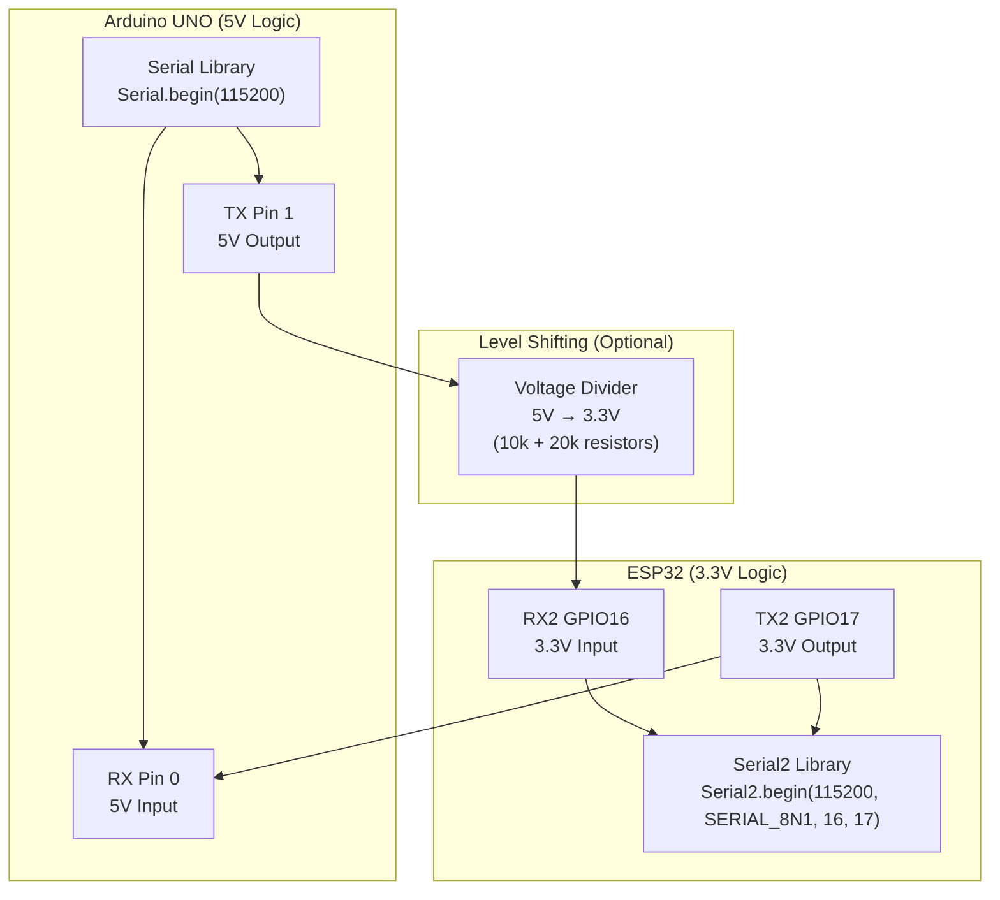

# Arduino-to-ESP32 UART Communication

## Architecture Overview



## Physical Wiring

```
Arduino UNO (5V)        ESP32 (3.3V)
┌──────────────────┐    ┌─────────────────────┐
│                  │    │                     │
│  TX (Pin 1) ────┼────┼──▶ RX2 (GPIO16)     │
│                  │    │                     │
│  RX (Pin 0) ◀───┼────┼──── TX2 (GPIO17)   │
│                  │    │                     │
│  GND ─────────┬──┼────┼──── GND (CRITICAL)  │
│               │  │    │                     │
└──────────────┼──┘    └────┬────────────────┘
               │             │
         [USB Cable]    [Micro USB Cable]
```

## Voltage Level Consideration

### Voltage Levels

| Signal | Arduino TX | ESP32 RX | ESP32 TX | Arduino RX |
| --- | --- | --- | --- | --- |
| HIGH | 5V | 3.3V max | 3.3V | 5V tolerant |
| LOW | 0V | 0V | 0V | 0V |
| Threshold | 2.5V | ~1.6V | ~1.6V | ~2.0V |

### TX to RX2 Path (5V → 3.3V)

**Direct Connection** (USB isolation provides protection):
```
Arduino TX (5V) ──────→ ESP32 RX2 (3.3V max input)
```

**Why it works**:
- USB isolation between Arduino and ESP32 grounds
- Arduino TX briefly samples at 5V
- ESP32 RX2 input threshold is ~1.6V
- 5V is well above 1.6V, so reads as HIGH
- Modern ESP32 boards have ESD protection

**Risk**: Over time, repeated 5V stress can degrade input protection circuit

**Safer Solution** (optional voltage divider):
```
Arduino TX (5V) ──[10kΩ]──┬─→ ESP32 RX2 (3.3V)
                          │
                        [20kΩ]
                          │
                         GND

Output voltage = 5V × (20k / (10k + 20k)) = 3.33V ✓
```

### TX2 to RX Path (3.3V → 5V)

**Direct Connection** (safe):
```
ESP32 TX2 (3.3V) ──────→ Arduino RX (5V tolerant input)
```

**Why it works**:
- Arduino RX input is 5V tolerant
- 3.3V is well above Arduino's ~2.0V HIGH threshold
- No protection needed
- This direction is always safe

## Communication Flow

```
Time    Arduino UNO (Sender)    ESP32 (Receiver on Serial2)
─────────────────────────────────────────────────────────────
0       [startup]
        Serial.begin(115200)
                                [startup]
                                Serial2.begin(115200, ..., 16, 17)
                                Waiting on RX2...

1.5 sec Sends: "TEMP=27\n"
        TX outputs 8 bits/character
        at 115200 baud
        ─────────────────────────────→
                                RX2 receives all bits
                                UART hardware reconstructs bytes
                                Buffer: "TEMP=27\n"
                                Detects newline
                                Serial2.available() = true
                                Application receives message
                                Parses: key="TEMP", value="27"
                                Validates: 0 ≤ 27 ≤ 100 ✓
                                Sends ACK back (if implemented)

3.0 sec Sends: "HUM=62\n"
        ─────────────────────────────→
                                RX2 receives
                                Parses: key="HUM", value="62"
                                Validates: 0 ≤ 62 ≤ 100 ✓
```

## Serial2 Configuration on ESP32

### UART Instances on ESP32

| Instance | Default Pins | Primary Use | Available |
| --- | --- | --- | --- |
| Serial (UART0) | TX=1, RX=3 | USB programming | Yes (shared with USB) |
| Serial1 (UART1) | TX=10, RX=9 | PSRAM (some boards) | Maybe |
| Serial2 (UART2) | TX=17, RX=16 | General purpose | **Yes (recommended)** |

### Serial2 Initialization

```cpp
// Arduino IDE syntax:
Serial2.begin(115200, SERIAL_8N1, 16, 17);
//                    ├─ Config  ├─ RX ├─ TX

// Parameters:
// - Baud: 115200 (must match sender)
// - SERIAL_8N1: 8 data bits, No parity, 1 stop bit
// - RX pin: GPIO16
// - TX pin: GPIO17
```

## Timing & Baud Rate Comparison

At **115200 baud** (12× faster than Exercise 02):

```
Message: "TEMP=25\n" = 8 characters = 80 bits

Time to transmit: 80 bits ÷ 115200 bps = 0.694 milliseconds
Time per character: 10 bits ÷ 115200 bps = 0.087 milliseconds

At 9600 baud:
Time per character: 10 bits ÷ 9600 bps = 1.042 milliseconds
                                          ▲
                                     12× slower

Example latency (from TX to reception):
At 9600 baud:   ~10.4 ms for "TEMP=25"
At 115200 baud: ~0.87 ms for "TEMP=25"
Difference:     ~9.5× faster transmission
```

## Data Validation on Receiver

```
Incoming message: "TEMP=27\n"

Step 1: Read line until '\n'
        Buffer: "TEMP=27"

Step 2: Split on '='
        Key: "TEMP"
        Value: "27"

Step 3: Validate key
        Is "TEMP" known? Yes ✓
        Is "TEMP" in valid list? Yes ✓

Step 4: Validate value
        Is "27" numeric? Yes ✓
        0 ≤ 27 ≤ 100? Yes ✓

Step 5: Process
        Store temperature = 27
        Log: "TEMP=27 received and validated"
        Optional: Send ACK back
```

## Platform Interoperability Matrix

| Aspect | Arduino UNO | ESP32 |
| --- | --- | --- |
| **Voltage Logic** | 5V | 3.3V |
| **Default Baud Rate** | 9600 (common in tutorials) | 115200 (modern default) |
| **UART Instances** | 1 (Serial only) | 3 (Serial, Serial1, Serial2) |
| **Max Baud Rate** | 115200 | 4,000,000+ |
| **Processing Power** | 16 MHz | 80-240 MHz |
| **TX Pin** | Pin 1 | GPIO17 (Serial2) |
| **RX Pin** | Pin 0 | GPIO16 (Serial2) |
| **Buffer Size** | 64 bytes | 128+ bytes |

## Error Scenarios

### Scenario 1: RX2 Not Connected

```
Expected: "TEMP=27"
Received: [nothing]
Symptom: Serial Monitor shows no data
Root Cause: GPIO16 not wired to Arduino TX
Solution: Check wiring diagram, verify GPIO16 is RX2
```

### Scenario 2: Baud Rate Mismatch

```
Arduino TX: 115200 baud
ESP32 RX2: 9600 baud (wrong!)

Expected: "TEMP=27"
Received: "T●M□27" (garbled)
Symptom: Random characters appear
Root Cause: Timing mismatch in UART reconstruction
Solution: Match baud rates exactly
```

### Scenario 3: GND Not Connected

```
Arduino GND: (not connected)
ESP32 GND: (not connected)

Expected: "TEMP=27"
Received: [garbage or nothing]
Symptom: Completely unreliable
Root Cause: No common voltage reference
Solution: ALWAYS connect GND first
```

## Real-World Use Cases

| Scenario | Direction | Protocol |
| --- | --- | --- |
| Arduino reads temperature from ESP32 sensor | Arduino RX ← ESP32 TX | Key=Value telemetry |
| Arduino sends commands to ESP32 relay | Arduino TX → ESP32 RX | Command packets |
| Arduino logs ESP32 WiFi status | Arduino RX ← ESP32 TX | Text status updates |
| Central Arduino coordinates multiple ESP32s | 1-to-many | Request-response |

## Advantages of Arduino-to-ESP32

| Benefit | Why |
| --- | --- |
| **Hybrid Systems** | Combine Arduino simplicity with ESP32 WiFi |
| **Modular Design** | Independent devices can be updated separately |
| **Cost Effective** | Use cheaper Arduino for simple tasks, ESP32 for complex |
| **Distributed Processing** | Divide work between boards |
| **Redundancy** | If ESP32 WiFi fails, Arduino continues local work |

## See Also

- [Exercise 03 - Arduino-to-ESP32 UART](../../Exercise-03-Arduino-to-ESP32-UART/)
- [UART Frame Structure](uart-frame-structure.md)
- [ESP32 Bidirectional UART](esp32-bidirectional-uart.md)
- [Voltage Level Shifting Guide](uart-advanced-topics.md)
