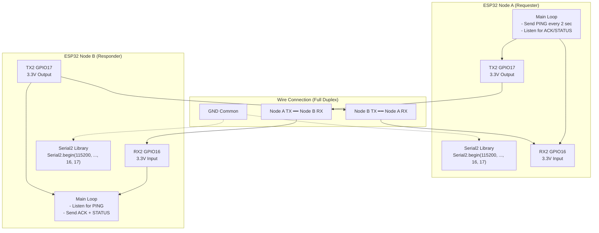
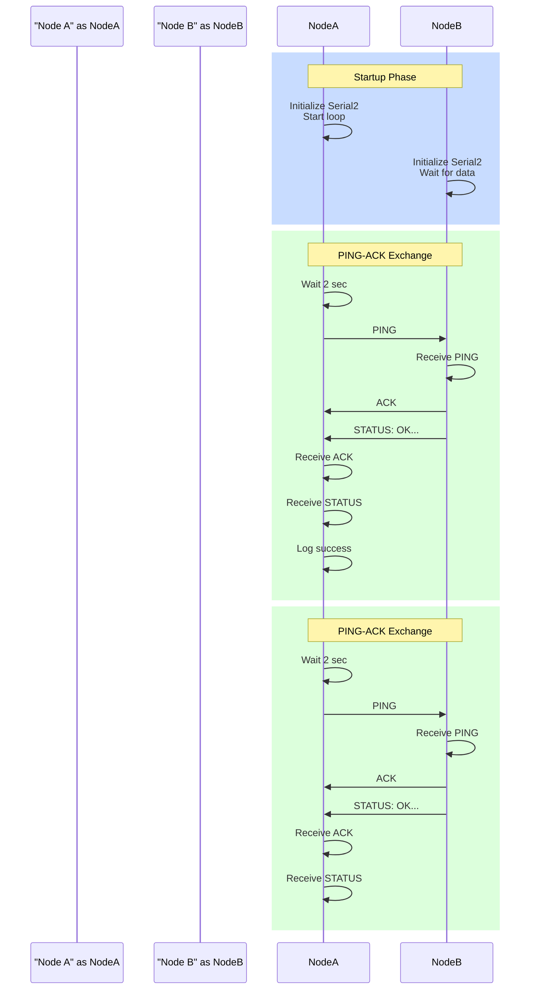

# ESP32 Bidirectional UART Communication

## Architecture Overview



## Physical Wiring

```
ESP32 Node A (Requester)     ESP32 Node B (Responder)
┌────────────────────────┐   ┌────────────────────────┐
│                        │   │                        │
│  GPIO17 (TX2) ────────┼───┼──→ GPIO16 (RX2)       │
│                        │   │                        │
│  GPIO16 (RX2) ←───────┼───┼──── GPIO17 (TX2)      │
│                        │   │                        │
│  GND ───────────┬──────┼───┼─── GND                │
│                 │      │   │                        │
│  (3.3V, 240MHz) │      │   │  (3.3V, 240MHz)      │
└─────────────────┼──────┘   └────┬───────────────────┘
                  │                │
            [Micro USB]        [Micro USB]
         (Programmer &       (Programmer &
          Serial Monitor)    Serial Monitor)
```

## Communication Sequence Diagram



## Timing Timeline

```
Time (sec)    Node A Action              Node B Action
───────────────────────────────────────────────────────
0             [Startup]                  [Startup, waiting]
              Initialize Serial2         Initialize Serial2

2             Send: "PING\n"
              ─────────────────────→      Receive PING
                                        Send: "ACK\n"
              Receive: "ACK"
              ←─────────────────────
                                        Send: "STATUS:..."
              Receive: STATUS
              ←─────────────────────
              Log success

4             Send: "PING\n"
              ─────────────────────→      Receive PING
                                        Send: "ACK\n"
              Receive: "ACK"
              ←─────────────────────

6             Send: "PING\n"
              ─────────────────────→      Receive PING
                                        Send: "ACK\n"
              Receive: "ACK"
              ←─────────────────────

(repeats every 2 seconds)
```

## Full-Duplex Advantage

### Half-Duplex (Exercise 02: Arduino-to-Arduino)
```
Node A TX: ═══════════════════════════════════════
Node A RX: ═══════════════════════════════════════
Node B TX: ═════════════════════════════════════════
Node B RX: ═════════════════════════════════════════
```
Problem: Both nodes cannot transmit and receive simultaneously

### Full-Duplex (Exercise 04: ESP32-to-ESP32)
```
Node A TX: │PING  │      │PING  │      │PING  │
Node A RX: │      │ACK   │      │ACK   │      │ACK
Node B TX: │      │ACK   │      │ACK   │      │ACK
Node B RX: │PING  │      │PING  │      │PING  │
           ───────────────────────────────────────
           Time -->
```
Advantage: Node A can send next PING while receiving previous ACK

## Message Protocol

### Message Types

| Direction | Message | Format | Purpose |
| --- | --- | --- | --- |
| A → B | PING | `PING\n` | Request status |
| B → A | ACK | `ACK\n` | Acknowledge receipt |
| B → A | STATUS | `STATUS: OK\|...\n` | Send status info |

### Message Content

**PING** (5 bytes):
```
P I N G \n
```

**ACK** (4 bytes):
```
A C K \n
```

**STATUS** (variable, example 35 bytes):
```
S T A T U S : space O K | U p t i m e = 2 s | P I N G s = 1 \n
```

## Processing Model

### Node A (Requester)

```cpp
Loop iteration (every 10 ms):

1. Check if time for PING (every 2000 ms)
   if (millis() - lastPingTime >= 2000) {
     sendPing();
     lastPingTime = millis();
   }

2. Check for incoming data on RX2
   if (Serial2.available() > 0) {
     receiveMessage();
   }

3. Small delay (10 ms)
   delay(10);
```

### Node B (Responder)

```cpp
Loop iteration (every 10 ms):

1. Check for incoming data on RX2
   if (Serial2.available() > 0) {
     receiveMessage();  // Parses PING
   }

2. If PING received, immediately send ACK+STATUS
   (handled in receiveMessage())

3. Small delay (10 ms)
   delay(10);
```

## No Synchronization Needed

Unlike some protocols, UART doesn't need clock or handshaking:

```
Traditional SPI (synchronous):
  Master ─→ Slave
  ├─ Data  (MOSI)
  ├─ Data  (MISO)
  ├─ Clock (SCK)  ← Timing synchronization
  └─ Chip Select (CS)

UART (asynchronous):
  Node A ←──→ Node B
  ├─ TX     ← Timing determined by baud rate alone
  ├─ RX     ← No extra clock signal needed
  └─ GND    ← Common reference only
```

**Why UART works without clock**:
- Both sides agree on baud rate (9600, 115200, etc.)
- UART hardware generates its own clock internally
- Start bit synchronizes receiver timing
- No clock line needed (simpler wiring)

## Advantages over Arduino-to-Arduino

| Feature | Arduino (Ex. 02) | ESP32 (Ex. 04) |
| --- | --- | --- |
| **UARTs Available** | 1 (pins 0/1 only) | 3 (Serial, Serial1, Serial2) |
| **Simultaneous TX/RX** | Difficult | Natural (true full-duplex) |
| **Baud Rate** | 9600 typical | 115200 standard |
| **Processing Speed** | 16 MHz | 80-240 MHz |
| **Memory** | 2 KB RAM | 160+ KB RAM |
| **Additional Features** | None | WiFi, Bluetooth, crypto |

## Scaling to 3+ Nodes

Full-duplex UART is point-to-point (2 nodes only). For 3+ nodes:

### Option 1: Star Topology
```
        ┌─────────┐
        │Node A   │
        │(Master) │
        └─────────┘
           ↙   ↘
      Node B  Node C
     (Slave) (Slave)
```

Node A communicates with B and C on separate UART channels.
Requires: Node A with Serial2 + Serial1, or use extra boards.

### Option 2: Bus Topology (CAN or RS-485)
```
Node A ─┬─ Node B
        │
        ├─ Node C
        │
        └─ Node D
```

Use CAN bus or RS-485 (different protocol, not UART).

### Option 3: Time-Multiplexed UART
Nodes take turns transmitting on shared line.
Complex arbitration logic required.

## Real-World Applications

| Application | Node A Role | Node B Role | Protocol |
| --- | --- | --- | --- |
| Sensor Network | Central logger | Sensor node | Periodic polling |
| Robot Coordination | Main controller | Motor controller | Command + feedback |
| Home Automation | Central hub | Smart device | Request-response |
| Distributed Data | Master server | Slave node | Heartbeat + status |

## Testing Full-Duplex Behavior

### Test 1: Message Rate
Count messages sent and received per second:
```
Expected: 0.5 msg/sec (one PING every 2 seconds)
Actual: Should match
```

### Test 2: ACK Timing
Measure time from PING to ACK:
```
At 115200 baud, ACK (4 bytes) arrives in: ~0.35 ms
```

### Test 3: Simultaneous TX/RX
Verify Node A sending doesn't block Node B receiving:
```
Send PING while receiving previous ACK
Both should complete without waiting
```

## Troubleshooting

| Problem | Cause | Solution |
| --- | --- | --- |
| No ACK received | RX2 not connected | Check GPIO16 wiring |
| Delayed ACK (>50 ms) | Processing bottleneck | Check CPU load |
| Mixed messages (garbage) | Baud mismatch | Verify both 115200 |
| One direction works | TX/RX reversed | Check wiring diagram |
| Increasing latency | Buffer filling | Slow down transmission rate |
| Random loss of ACK | Timing race condition | Add small delays, use ISR |

## See Also

- [Exercise 04 - ESP32 Chat](../../Exercise-04-ESP32-UART-Chat/)
- [UART Frame Structure](uart-frame-structure.md)
- [Arduino-to-Arduino (Half-Duplex)](arduino-to-arduino-uart.md)
- [Advanced: Protocol Design Principles](uart-advanced-topics.md)
