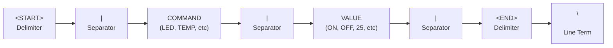
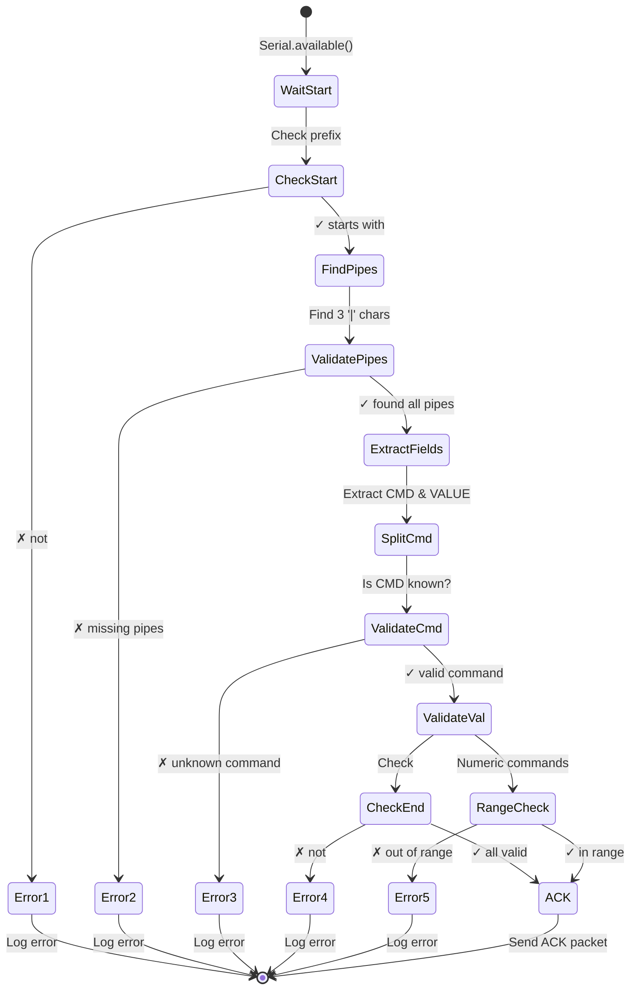

# UART Command Protocol Packet Structure

## Packet Format



## Byte-Level Structure

```
Byte Index:  0   1   2   3   4   5   6   7   8   9  10  11  12  13  14  15  16  17  18  19
             │   │   │   │   │   │   │   │   │   │   │   │   │   │   │   │   │   │   │   │
Content:     │ < │ S │ T │ A │ R │ T │ > │ | │ L │ E │ D │ | │ O │ N │ | │ < │ E │ N │ D │ > │
             │   │   │   │   │   │   │   │   │   │   │   │   │   │   │   │   │   │   │   │
             └─────────────────────────────────────────────────────────────────────────────┘
                            Full packet for: <START>|LED|ON|<END>
                            (20 bytes total)

             └──── START ────┘ │ │ COMMAND │ │ VALUE │ │ END │

             7 bytes          1 3 bytes  1 2 bytes 1 5 bytes
```

## Valid Packets

### LED Control
```
<START>|LED|ON|<END>
<START>|LED|OFF|<END>

Validation:
- Command: "LED" ✓
- Value: "ON" or "OFF" ✓
- Response: ACK|LED|ON  or  ACK|LED|OFF
```

### Temperature Setting
```
<START>|TEMP|25|<END>
<START>|TEMP|0|<END>
<START>|TEMP|100|<END>

Validation:
- Command: "TEMP" ✓
- Value: numeric, 0-100 ✓
- Out of range: <START>|TEMP|150|<END> ✗ (150 > 100)
- Response: ACK|TEMP|25  or  ERROR: TEMP out of range
```

### Relay Control
```
<START>|RELAY|ON|<END>
<START>|RELAY|OFF|<END>
<START>|RELAY|TOGGLE|<END>

Validation:
- Command: "RELAY" ✓
- Value: "ON", "OFF", or "TOGGLE" ✓
- Response: ACK|RELAY|ON
```

### Status Query
```
<START>|STATUS|QUERY|<END>
<START>|STATUS|OK|<END>

Validation:
- Command: "STATUS" ✓
- Value: any text accepted
- Response: ACK|STATUS|OK
```

## Invalid Packets (Error Handling)

```
Malformed Packet                      Error Code
────────────────────────────────────────────────────────
START|LED|ON|<END>                    ERR_MISSING_START
<START>|LED|ON                        ERR_MISSING_END
<START>|LED|ON|END>                   ERR_INVALID_END
<START>LED|ON|<END>                   ERR_MISSING_PIPE
<START>|LED|MAYBE|<END>               ERR_INVALID_VALUE
<START>|LIGHT|ON|<END>                ERR_UNKNOWN_COMMAND
<START>|TEMP|xyz|<END>                ERR_NON_NUMERIC
<START>|TEMP|150|<END>                ERR_OUT_OF_RANGE
<START>|TEMP|25.5|<END>               ERR_FLOAT_NOT_INT
```

## Parsing State Machine



## Transmission Timeline

```
Time (ms)   Sender                     Receiver
─────────────────────────────────────────────────
0           Application sends:
            "LED|ON"

5           Encapsulates packet:
            <START>|LED|ON|<END>\n

10          Starts TX on Serial2
            (17 bytes @ 115200 = ~1.5 ms)

12          ───────────────────────→   Starts receiving
                                      byte 0: '<'
                                      byte 1: 'S'
                                      ...
                                      byte 16: '>'
                                      byte 17: '\n'

14          TX complete                RX complete
            Waits 2 sec before          Parses packet
            next packet                 Validates format
                                      Validates command
                                      Responds: ACK|LED|ON\n

16                                    TX ACK (17 bytes)

18          ←─────────────────────── RX ACK packet
            Receives and logs ACK
```

## Bandwidth Calculation

**Packet**: `<START>|LED|ON|<END>\n` (17 bytes = 170 bits)

At **115200 baud**:
```
Time = 170 bits ÷ 115200 bps = 1.48 milliseconds per packet
Max packets: 1000 ms ÷ 1.48 ms ≈ 676 packets/second (theoretical)
```

Practical throughput with processing:
```
Processing + ACK: ~5-10 ms per cycle
Realistic: ~100 packets/second sustainable
```

## Extensibility Example

Adding new command: `BUZZER` with values `BEEP`, `SILENT`

```
New Packet Format:
<START>|BUZZER|BEEP|<END>

Parsing Addition:
case "BUZZER":
  if (value == "BEEP" || value == "SILENT") {
    sendACK();
  } else {
    sendERROR("Invalid BUZZER value");
  }
```

No format changes needed; just extend the validation logic.

## Comparison with Other Protocols

| Feature | This Protocol | Modbus | CAN | MQTT |
| --- | --- | --- | --- | --- |
| **Format** | ASCII | Binary | Binary | JSON |
| **Readability** | High | Low | Low | High |
| **Efficiency** | Medium | High | High | Low |
| **Error Detection** | Format check | CRC | CRC | Checksum |
| **Hardware Needed** | UART | RS-485 | CAN controller | Ethernet/WiFi |
| **Complexity** | Low | Medium | Medium | High |
| **Learning Curve** | Easy | Moderate | Moderate | Steep |

## Debugging Tips

### Capture Transmission with Serial Monitor

1. Set baud rate to match (115200)
2. Watch raw bytes arrive:
   ```
   <START>|LED|ON|<END>
   <START>|LED|OFF|<END>
   ```

### Add Logging at Each Step

```cpp
Serial.print("Raw: \""); Serial.println(packet);
Serial.print("Found START: "); Serial.println(packet.startsWith("<START>"));
Serial.print("Found END: "); Serial.println(packet.endsWith("<END>"));
Serial.print("CMD: "); Serial.println(command);
Serial.print("VAL: "); Serial.println(value);
```

### Test Edge Cases

```
<START>|LED|ON|<END>       ✓ Valid
<START>|LED|on|<END>       ✗ Case sensitive
<START>|LED|ON |<END>      ✗ Extra space
<START> |LED|ON|<END>      ✗ Space after START
<START>|LED||<END>         ✗ Empty value
<START>|LED|<END>          ✗ Missing value field
<START>||ON|<END>          ✗ Empty command
```

## Real-World Industrial Protocols

This educational protocol mirrors real systems:

| Industry | Protocol | Format | Use |
| --- | --- | --- | --- |
| Manufacturing | Modbus | Binary with CRC | PLC control |
| Automotive | CAN | Binary with priority | Vehicle networks |
| Smart Home | MQTT | JSON | IoT devices |
| Telemetry | NMEA | ASCII with checksum | GPS/Marine |

## See Also

- [Exercise 05 - UART Command Protocol](../../Exercise-05-UART-Command-Protocol/)
- [UART Frame Structure](uart-frame-structure.md)
- [Modbus Protocol](https://modbus.org/)
- [CAN Bus Reference](https://en.wikipedia.org/wiki/CAN_bus)
