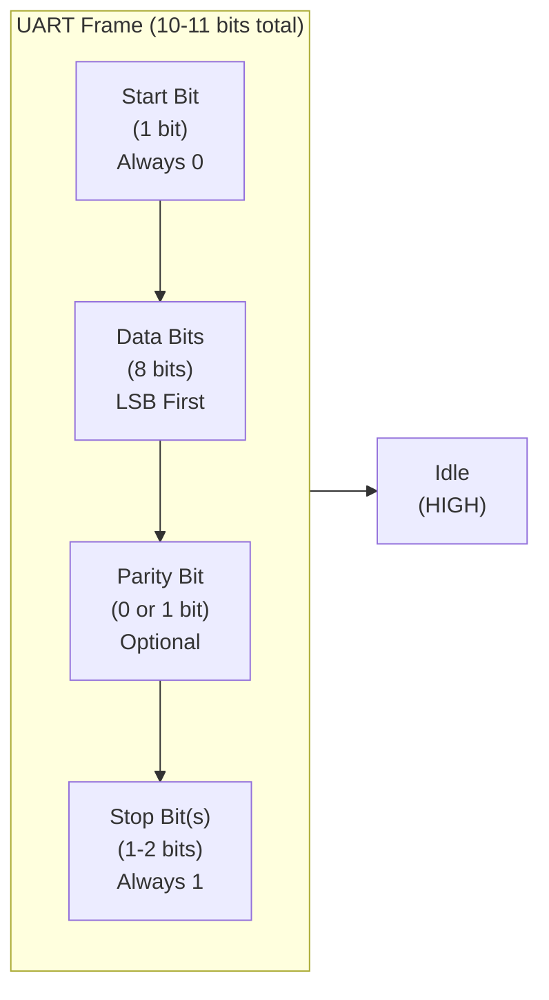

# UART Frame Structure

## UART Frame Anatomy



## Visual Timeline

Transmitting character 'A' (ASCII 65 = binary 01000001) at 9600 baud:

```
Bit timing at 9600 baud: 1 bit = 1/9600 seconds ≈ 104.17 microseconds

Idle  │ START │ BIT0 │ BIT1 │ BIT2 │ BIT3 │ BIT4 │ BIT5 │ BIT6 │ BIT7 │ STOP │ Idle
      │   0   │  1   │  0   │  0   │  0   │  0   │  1   │  0   │  0   │  1   │
HIGH  └───────┴──────┴──────┴──────┴──────┴──────┴──────┴──────┴──────┴──────┘
LOW           ▔▔▔▔▔▔▔▔▔▔▔▔▔▔▔▔▔▔▔▔▔▔▔▔▔▔▔▔▔▔▔▔▔▔▔▔▔▔▔▔▔▔▔▔▔▔▔▔▔▔▔▔▔▔▔▔▔▔

Time  0 µs  104   208   312   416   520   624   728   832   936  1040  1144 µs
            ├─────────────────────────────────────────────────────────┤
                    Total transmission time ≈ 1.04 milliseconds
```

## Bit Timing Reference

| Baud Rate | Bits/Second | Time per Bit | 10-bit Frame Time | Chars/Second |
| --- | --- | --- | --- | --- |
| 300 | 300 | 3.33 ms | 33.3 ms | 30 |
| 1200 | 1200 | 833 µs | 8.33 ms | 120 |
| 2400 | 2400 | 417 µs | 4.17 ms | 240 |
| 4800 | 4800 | 208 µs | 2.08 ms | 480 |
| **9600** | 9600 | 104 µs | 1.04 ms | 960 |
| 19200 | 19200 | 52 µs | 520 µs | 1920 |
| 38400 | 38400 | 26 µs | 260 µs | 3840 |
| **115200** | 115200 | 8.68 µs | 87 µs | 11520 |

## UART Frame Components

### Start Bit
- **Value**: Always 0 (LOW)
- **Purpose**: Signals receiver to start listening
- **Detection**: Receiver samples RX line at center of bit period
- **Timing**: Receiver clock synchronizes to this transition

### Data Bits
- **Count**: 8 bits (standard)
- **Order**: LSB (Least Significant Bit) first
- **Example**: Char 'A' = ASCII 65 = 0x41 = binary 01000001
  - Transmitted as: 1, 0, 0, 0, 0, 1, 0, 0 (reversed order)
  - Why reversed: Historical convention for simple hardware

### Parity Bit (Optional)
- **Count**: 0 or 1 bit
- **Purpose**: Simple error detection
- **Types**:
  - **Even Parity**: Number of 1-bits (including parity) is even
  - **Odd Parity**: Number of 1-bits (including parity) is odd
- **Example**: Sending 0x41 (01000001, has 2 ones) with even parity
  - Even parity bit = 0 (to keep total ones even)
  - Transmitted: 0, 1, 0, 0, 0, 0, 1, 0, 0 (including parity)
- **Note**: Most projects use SERIAL_8N1 (no parity)

### Stop Bit(s)
- **Value**: Always 1 (HIGH)
- **Count**: 1 or 2 bits (1 is standard)
- **Purpose**: Marks end of frame, synchronizes receiver
- **Timing**: Receiver returns to idle (HIGH) state

## Common Frame Configurations

| Config | Name | Bits | Total | Usage |
| --- | --- | --- | --- | --- |
| 8N1 | 8 data, No parity, 1 stop | 8+0+1 | 10 | Most common |
| 8N2 | 8 data, No parity, 2 stop | 8+0+2 | 11 | Legacy systems |
| 8E1 | 8 data, Even parity, 1 stop | 8+1+1 | 10 | Error-sensitive systems |
| 8O1 | 8 data, Odd parity, 1 stop | 8+1+1 | 10 | Alternative to even |
| 7E1 | 7 data, Even parity, 1 stop | 7+1+1 | 9 | Very old systems |

## Bandwidth Calculation

For UART transmission at given baud rate:

$$\text{Characters per Second} = \frac{\text{Baud Rate (bits/s)}}{\text{Bits per Character (typically 10)}}$$

**Example**: 115200 baud with 10 bits per character:
$$\text{Chars/s} = \frac{115200}{10} = 11,520 \text{ characters/second}$$

Or roughly **1.15 megabytes per second** for 8-bit data.

## Idle State

- **Between Frames**: TX line stays HIGH (1)
- **No Data**: Line held at logic HIGH (5V on Arduino, 3.3V on ESP32)
- **Why**: Start bit is detected as HIGH→LOW transition
- **Continuous Transmission**: Start bit immediately follows stop bit

## Timing Tolerance

UART is robust because receiver samples at **center of bit period**, not at bit edges:

```
Bit Period (104 µs at 9600)
├─ Sample Margin ─┤
   └─ Sampling Point (52 µs) ─┘

Receiver can tolerate ±5% timing error without data loss
(Error > 5% causes bit misalignment and data corruption)
```

## Related Topics

- [Baud Rate Mismatch Effects](../diagrams/uart-advanced-topics.md)
- [Noise and Error Handling](../diagrams/uart-advanced-topics.md)
- [Hardware vs Software UART](../diagrams/uart-advanced-topics.md)

## References

- [Arduino Serial Reference](https://www.arduino.cc/reference/en/language/functions/communication/serial/)
- [UART Wikipedia](https://en.wikipedia.org/wiki/Universal_asynchronous_receiver%E2%80%93transmitter)
- [Serial Port Reference](https://en.wikibooks.org/wiki/Serial_Programming/Serial_Ports)
