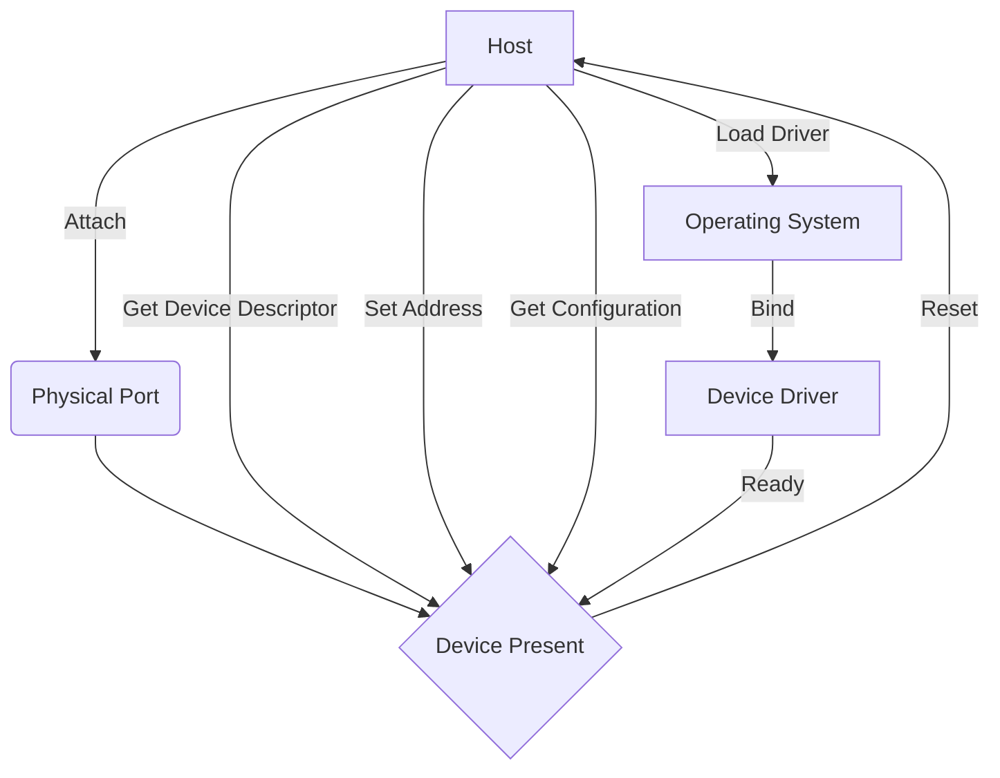

```mermaid
flowchart TD
  Host[Host] -->|Attach| Port(Physical Port)
  Port --> Device{Device Present}
  Device -->|Reset| Host
  Host -->|Get Device Descriptor| Device
  Host -->|Set Address| Device
  Host -->|Get Configuration| Device
  Host -->|Load Driver| OS[Operating System]
  OS -->|Bind| Driver[Device Driver]
  Driver -->|Ready| Device
```
