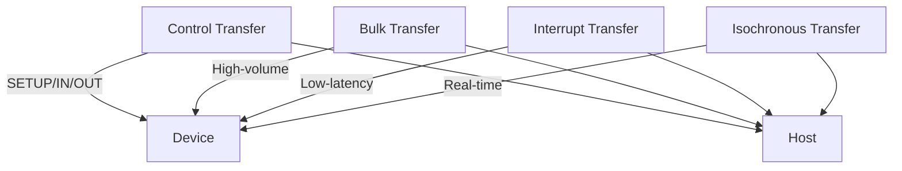

```mermaid
flowchart TB
  Control[Control Transfer] -->|SETUP/IN/OUT| Device
  Bulk[Bulk Transfer] -->|High-volume| Device
  Interrupt[Interrupt Transfer] -->|Low-latency| Device
  Isochronous[Isochronous Transfer] -->|Real-time| Device
  Control --> Host
  Bulk --> Host
  Interrupt --> Host
  Isochronous --> Host
```
