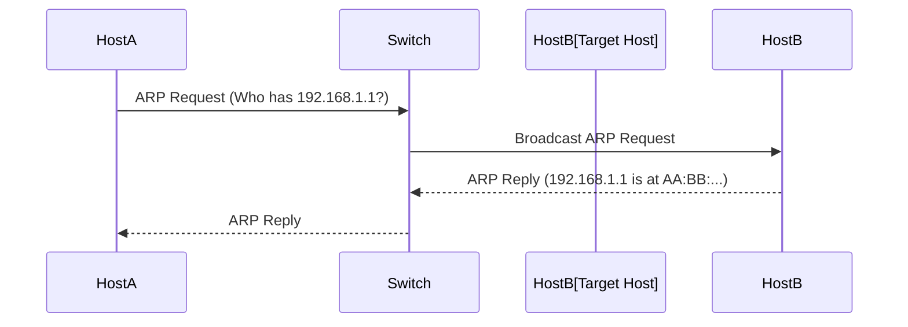

```mermaid
sequenceDiagram
    participant HostA
    participant Switch
    participant HostB[Target Host]

    HostA->>Switch: ARP Request (Who has 192.168.1.1?)
    Switch->>HostB: Broadcast ARP Request
    HostB-->>Switch: ARP Reply (192.168.1.1 is at AA:BB:...)
    Switch-->>HostA: ARP Reply
```

Notes: ARP requests are broadcast; replies are unicast.
