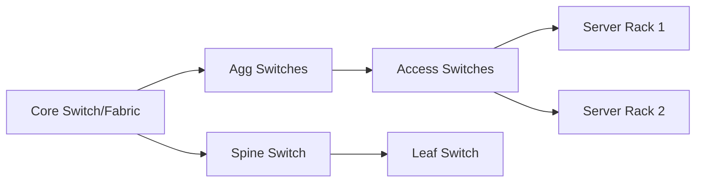

```mermaid
graph LR
    Core[Core Switch/Fabric] --> Agg[Agg Switches]
    Agg --> Access[Access Switches]
    Access --> Server1[Server Rack 1]
    Access --> Server2[Server Rack 2]
    Core --> Spine[Spine Switch]
    Spine --> Leaf[Leaf Switch]
```

Description: Simplified data center fabric (spine-leaf) topology for scale.
