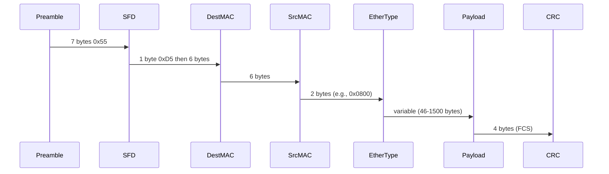

```mermaid
sequenceDiagram
    participant Preamble
    participant SFD
    participant DestMAC
    participant SrcMAC
    participant EtherType
    participant Payload
    participant CRC

    Preamble->>SFD: 7 bytes 0x55
    SFD->>DestMAC: 1 byte 0xD5 then 6 bytes
    DestMAC->>SrcMAC: 6 bytes
    SrcMAC->>EtherType: 2 bytes (e.g., 0x0800)
    EtherType->>Payload: variable (46-1500 bytes)
    Payload->>CRC: 4 bytes (FCS)
```

Diagram: Ethernet frame field order and sizes.
