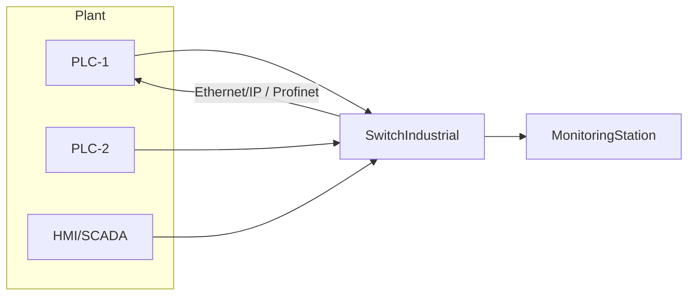

```mermaid
graph LR
    PLC1[PLC-1] --> SwitchIndustrial
    PLC2[PLC-2] --> SwitchIndustrial
    HMI[HMI/SCADA] --> SwitchIndustrial
    SwitchIndustrial --> MonitoringStation
    SwitchIndustrial -->|Ethernet/IP / Profinet| PLC1

    subgraph Plant
      PLC1;PLC2;HMI
    end
```

Notes: Industrial Ethernet often uses real-time protocols and deterministic QoS.
