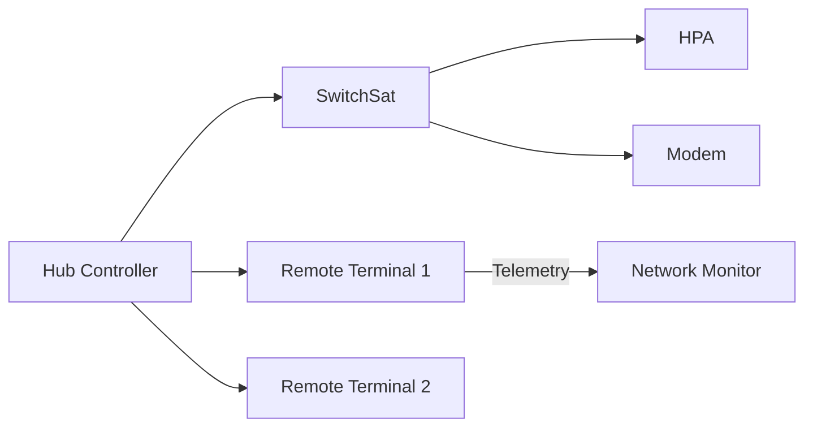

```mermaid
graph LR
    Hub[Hub Controller] --> SwitchSat
    SwitchSat --> HPA[HPA]
    SwitchSat --> Modem[Modem]
    Hub --> RT1[Remote Terminal 1]
    Hub --> RT2[Remote Terminal 2]
    RT1 -->|Telemetry| NMS[Network Monitor]
```

Notes: Hub controller orchestrates RTs, HPA, modems and provides telemetry to NMS.
