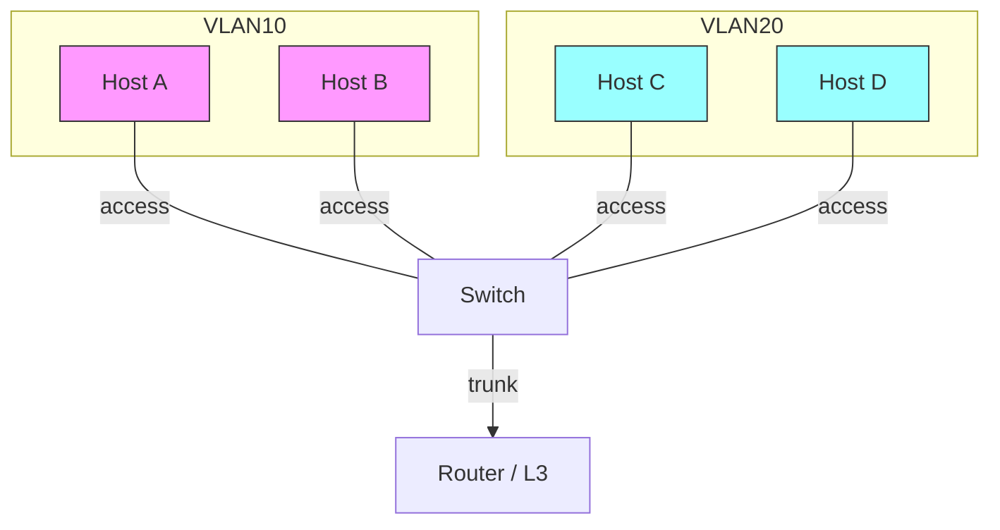

```mermaid
graph TB
    subgraph VLAN10
      A1[Host A]
      B1[Host B]
    end
    subgraph VLAN20
      C1[Host C]
      D1[Host D]
    end
    Switch -->|trunk| Router[Router / L3]
    A1 ---|access| Switch
    B1 ---|access| Switch
    C1 ---|access| Switch
    D1 ---|access| Switch

    classDef vlan10 fill:#f9f,stroke:#333
    classDef vlan20 fill:#9ff,stroke:#333
    class A1,B1 vlan10
    class C1,D1 vlan20
```

Description: VLAN segmentation example with inter-VLAN routing via L3.
