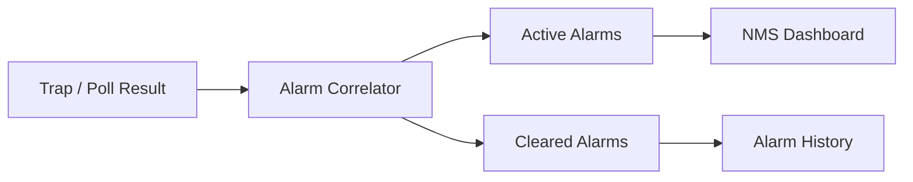

# Alarm Management Flow

The alarm manager correlates events, tracks active and cleared alarms, and feeds the dashboard.

## Notes
- Alarm severity helps prioritize response.
- Active and cleared views are both important for operations and postmortem analysis.
