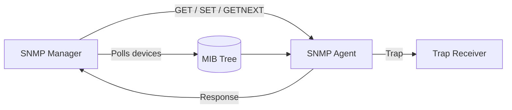

# SNMP Architecture

The manager polls devices, the agent owns the MIB, and traps provide asynchronous event delivery.

## Notes
- The manager is responsible for collection and presentation.
- The agent is responsible for object lookup and validation.
- The MIB is the schema of managed objects.
