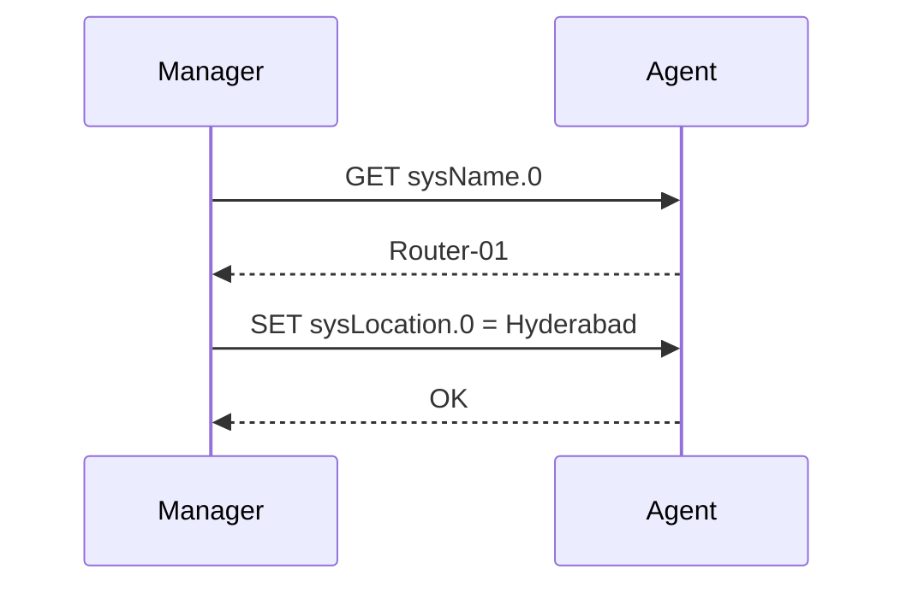

# SNMP Request / Response

This sequence shows the synchronous request/response path used by GET and SET.

## Notes
- The manager initiates every request.
- The agent replies with success or a validation error.
- SET must respect access mode and value constraints.
