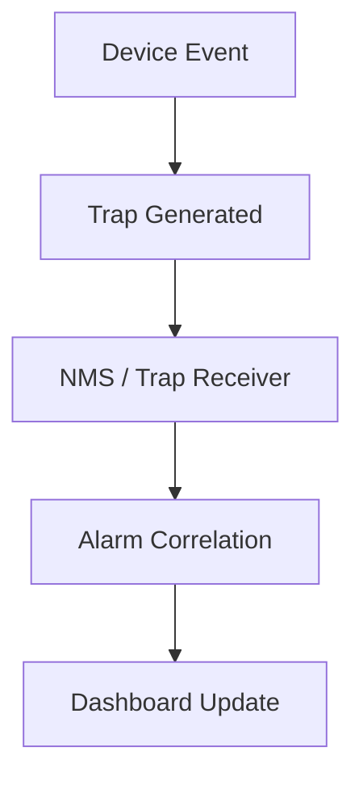

# SNMP Trap Flow

Traps allow the agent to notify the manager without waiting for a poll cycle.

## Notes
- High temperature, link down, and power failure are common trap sources.
- Correlation turns raw traps into actionable alarms.
