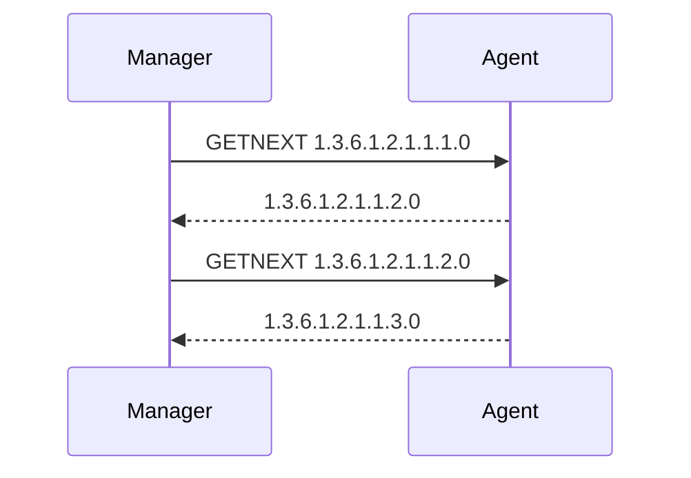

# SNMP Walk Sequence

```mermaid
sequenceDiagram
    participant M as Manager
    participant A as Agent
    M->>A: GETNEXT 1.3.6.1.2.1.1.1.0
    A-->>M: 1.3.6.1.2.1.1.2.0
    M->>A: GETNEXT 1.3.6.1.2.1.1.2.0
    A-->>M: 1.3.6.1.2.1.1.3.0
```

SNMP walk is an ordered GETNEXT traversal of a subtree.

## Notes
- Walks are useful for discovery and inventory collection.
- Traversal continues until the subtree ends.
