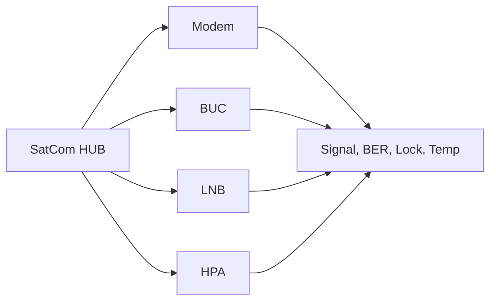

# Telecom SNMP Monitoring

This diagram shows how SNMP-style polling can be used to monitor telecom and SatCom ground equipment.

## Notes
- Signal strength and BER are critical operational indicators.
- Temperature and lock status are common escalation triggers.