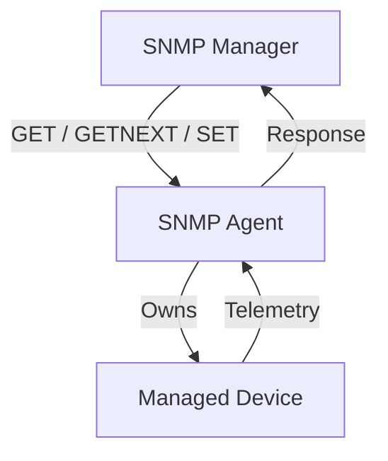

# Manager-Agent Architecture

```mermaid
flowchart TB
    Manager[SNMP Manager]
    Agent[SNMP Agent]
    Device[Managed Device]

    Manager -->|GET / GETNEXT / SET| Agent
    Agent -->|Response| Manager
    Agent -->|Owns| Device
    Device -->|Telemetry| Agent
```

The manager polls and aggregates state, the agent exposes the MIB, and the managed device provides live telemetry.
