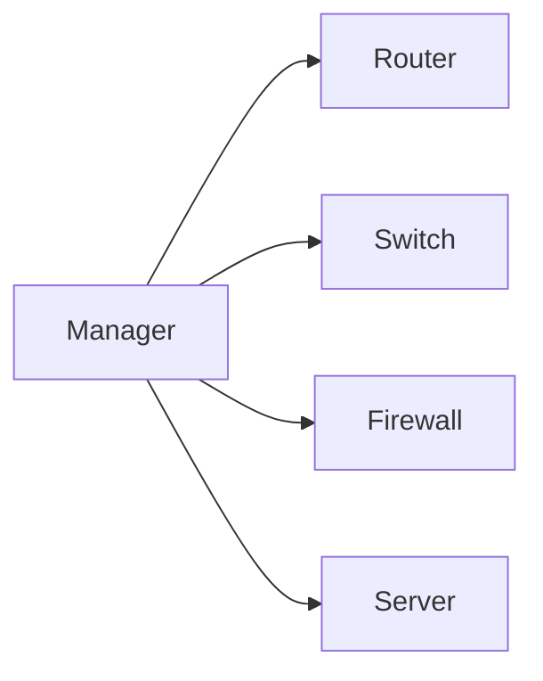

# Multi-Device Monitoring

```mermaid
flowchart LR
    Manager[Manager]
    Router[Router]
    Switch[Switch]
    Firewall[Firewall]
    Server[Server]

    Manager --> Router
    Manager --> Switch
    Manager --> Firewall
    Manager --> Server
```

This shows one manager polling many agents to build a centralized visibility layer.
