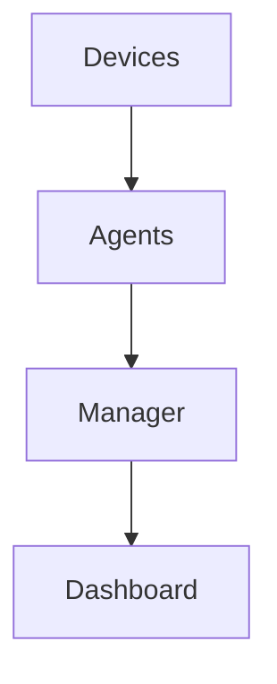

# NOC Dashboard Flow

```mermaid
flowchart TB
    Devices[Devices]
    Agents[Agents]
    Manager[Manager]
    Dashboard[Dashboard]

    Devices --> Agents
    Agents --> Manager
    Manager --> Dashboard
```

The NOC dashboard is the final aggregation layer where managers turn telemetry into operational visibility.
