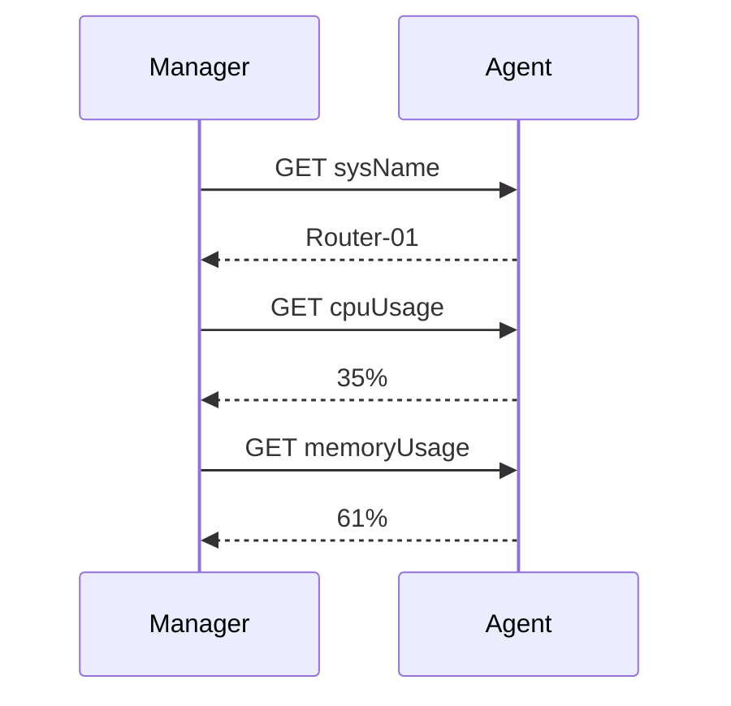

# SNMP Polling Flow

```mermaid
sequenceDiagram
    participant M as Manager
    participant A as Agent

    M->>A: GET sysName
    A-->>M: Router-01
    M->>A: GET cpuUsage
    A-->>M: 35%
    M->>A: GET memoryUsage
    A-->>M: 61%
```

Polling is manager-driven and returns a snapshot of device state at the time of the request.
