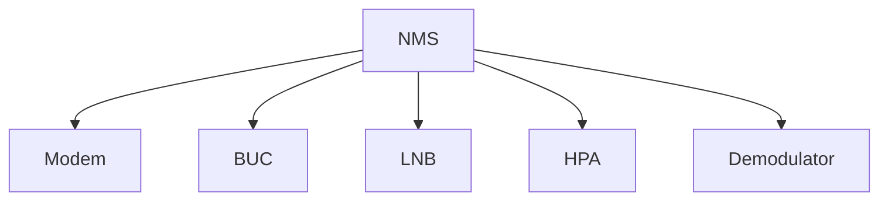

# Telecom Monitoring

```mermaid
flowchart TB
    NMS[NMS]
    Modem[Modem]
    BUC[BUC]
    LNB[LNB]
    HPA[HPA]
    Demod[Demodulator]

    NMS --> Modem
    NMS --> BUC
    NMS --> LNB
    NMS --> HPA
    NMS --> Demod
```

Telecom and SatCom monitoring focus on power, signal quality, lock state, and temperature.
