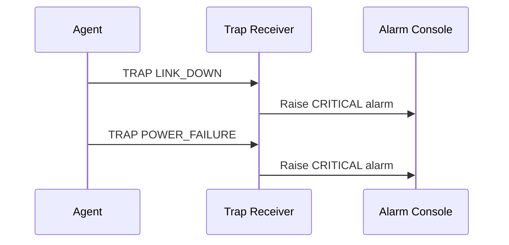

# Trap Processing Flow

```mermaid
sequenceDiagram
    participant Agent as Agent
    participant Receiver as Trap Receiver
    participant Alarm as Alarm Console

    Agent->>Receiver: TRAP LINK_DOWN
    Receiver->>Alarm: Raise CRITICAL alarm
    Agent->>Receiver: TRAP POWER_FAILURE
    Receiver->>Alarm: Raise CRITICAL alarm
```

Traps push faults immediately into the event pipeline without waiting for polling.
