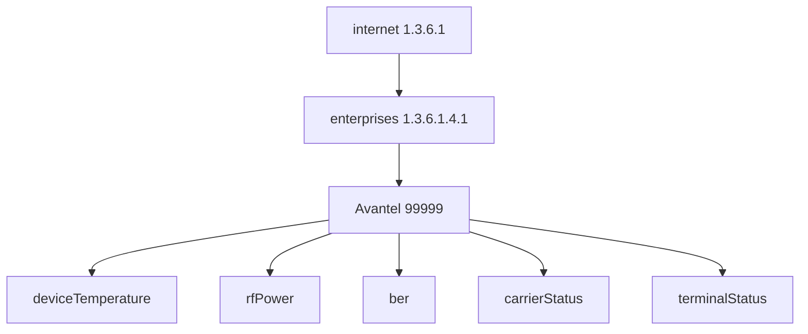

# Enterprise MIB Architecture

## Explanation
Enterprise MIBs live under the private enterprise branch and model vendor-specific telemetry such as RF power, temperature, and alarms.

## Mermaid

## Real-World Relevance
Vendors extend standard MIBs to expose platform-specific counters, alarms, and control points.

## Learning Outcomes
- Explain private enterprise numbering
- Distinguish standard and vendor objects
- Model telemetry under an enterprise branch
