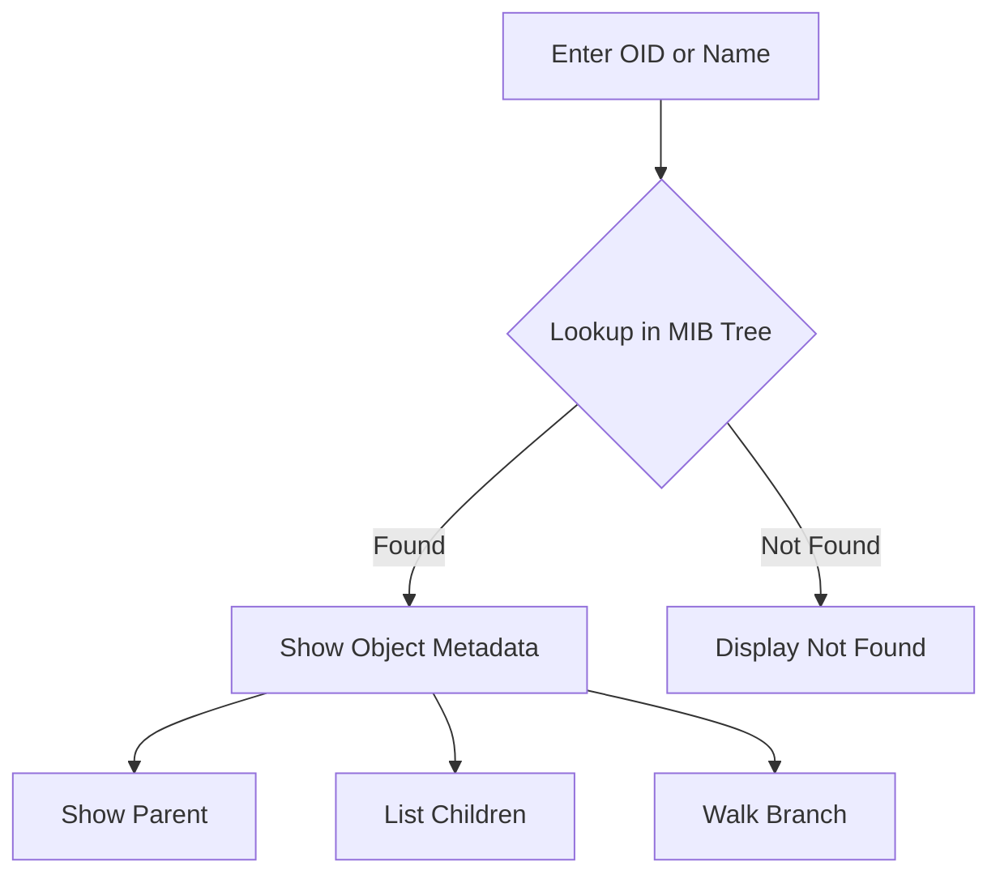

# MIB Browser Workflow

## Explanation
A browser lets an engineer search by OID or name, inspect parent and child nodes, and walk an entire branch.

## Mermaid

## Real-World Relevance
MIB browsers are used during device onboarding, troubleshooting, and vendor interoperability checks.

## Learning Outcomes
- Trace object discovery flow
- Explain hierarchical navigation
- Use browser output for troubleshooting
