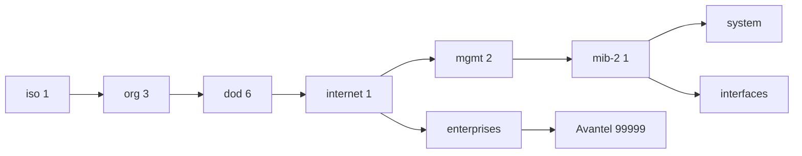

# MIB Hierarchy

## Explanation
This diagram shows the OID path from ISO to the MIB-II branch and then into standard and enterprise-managed objects.

## Mermaid

## Real-World Relevance
Operators navigate this hierarchy to discover object ownership, vendor extensions, and monitoring scope.

## Learning Outcomes
- Understand dotted OID structure
- Recognize standard and enterprise branches
- Explain how MIB trees support SNMP navigation
