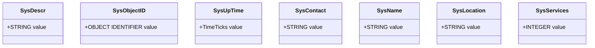

# MIB-II System Group

## Explanation
The system group contains core scalar objects that describe the managed node, its identity, uptime, and operator contact details.

## Mermaid

## Real-World Relevance
These objects are the first values NOC engineers check when validating device identity and operational health.

## Learning Outcomes
- Identify MIB-II system scalars
- Explain scalar object semantics
- Map system values to operational context
