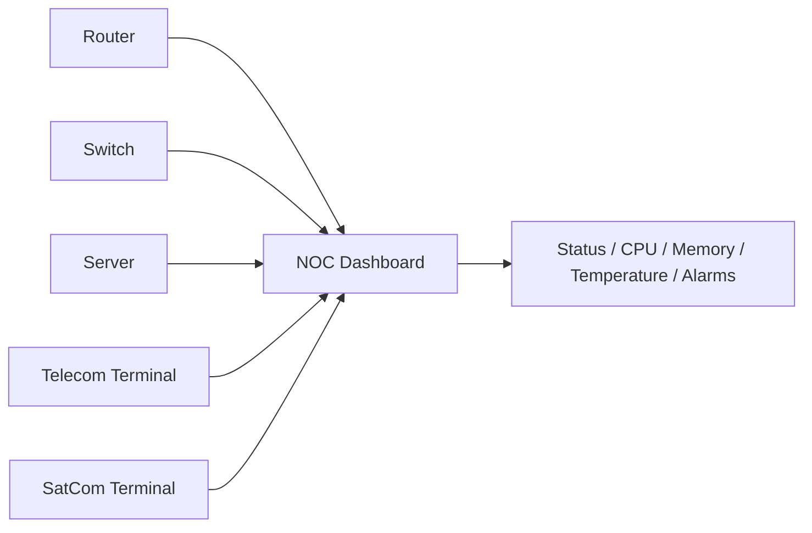

# NOC Dashboard Architecture

## Explanation
The NOC dashboard aggregates MIB data from routers, switches, servers, telecom nodes, and satellite terminals into one operational view.

## Mermaid

## Real-World Relevance
A centralized dashboard helps operators triage incidents quickly and compare fleets at a glance.

## Learning Outcomes
- Explain centralized monitoring
- Summarize multi-device visibility
- Connect MIB data to operations dashboards
