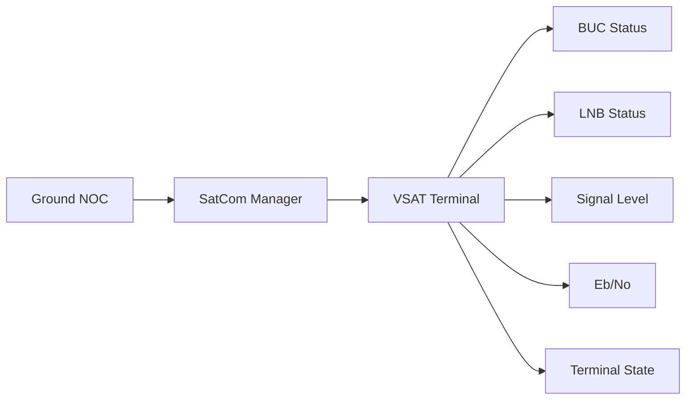

# SatCom Monitoring Flow

## Explanation
SatCom monitoring focuses on the terminal chain: BUC, LNB, signal quality, Eb/No, and terminal state.

## Mermaid

## Real-World Relevance
Operators use these values to maintain carrier lock, diagnose RF path issues, and protect service availability.

## Learning Outcomes
- Explain terminal health indicators
- Interpret Eb/No and signal quality
- Relate SatCom objects to field operations
