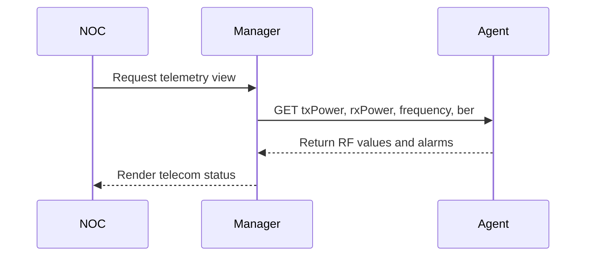

# Telecom Monitoring Flow

## Explanation
Telecom monitoring combines RF metrics, lock state, BER, and alarm state to show whether a terminal can carry service.

## Mermaid

## Real-World Relevance
This mirrors hub and terminal monitoring in microwave, satellite, and backhaul operations.

## Learning Outcomes
- Trace RF monitoring data flow
- Link BER to service quality
- Describe alarm-driven visibility
