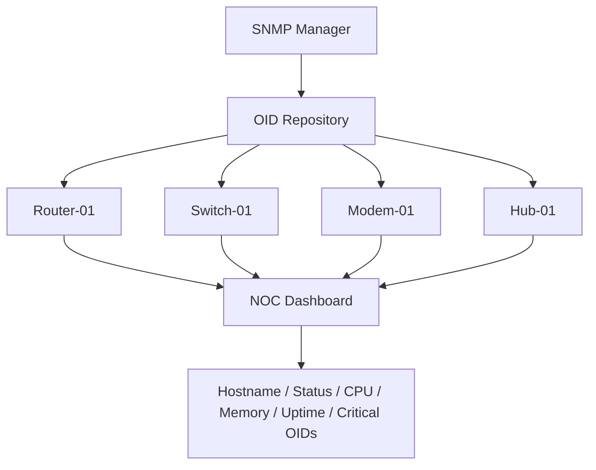

# NOC Dashboard Architecture

```mermaid
graph TD
    manager[SNMP Manager] --> repository[OID Repository]
    repository --> agent1[Router-01]
    repository --> agent2[Switch-01]
    repository --> agent3[Modem-01]
    repository --> agent4[Hub-01]
    agent1 --> dashboard[NOC Dashboard]
    agent2 --> dashboard
    agent3 --> dashboard
    agent4 --> dashboard
    dashboard --> summary[Hostname / Status / CPU / Memory / Uptime / Critical OIDs]
```
