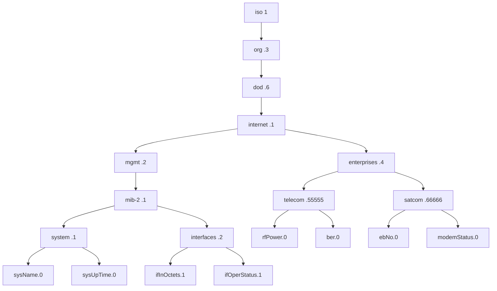

# OID Hierarchy

```mermaid
graph TD
    iso[iso 1] --> org[org .3]
    org --> dod[dod .6]
    dod --> internet[internet .1]
    internet --> mgmt[mgmt .2]
    mgmt --> mib2[mib-2 .1]
    mib2 --> system[system .1]
    mib2 --> interfaces[interfaces .2]
    internet --> enterprises[enterprises .4]
    enterprises --> telecom[telecom .55555]
    enterprises --> satcom[satcom .66666]
    system --> sysName[sysName.0]
    system --> sysUpTime[sysUpTime.0]
    interfaces --> ifInOctets[ifInOctets.1]
    interfaces --> ifOperStatus[ifOperStatus.1]
    telecom --> rfPower[rfPower.0]
    telecom --> ber[ber.0]
    satcom --> ebNo[ebNo.0]
    satcom --> modemStatus[modemStatus.0]
```
