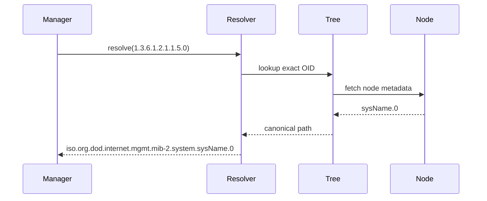

# OID Resolution Flow

```mermaid
sequenceDiagram
    participant Manager
    participant Resolver
    participant Tree
    participant Node

    Manager->>Resolver: resolve(1.3.6.1.2.1.1.5.0)
    Resolver->>Tree: lookup exact OID
    Tree->>Node: fetch node metadata
    Node-->>Tree: sysName.0
    Tree-->>Resolver: canonical path
    Resolver-->>Manager: iso.org.dod.internet.mgmt.mib-2.system.sysName.0
```
