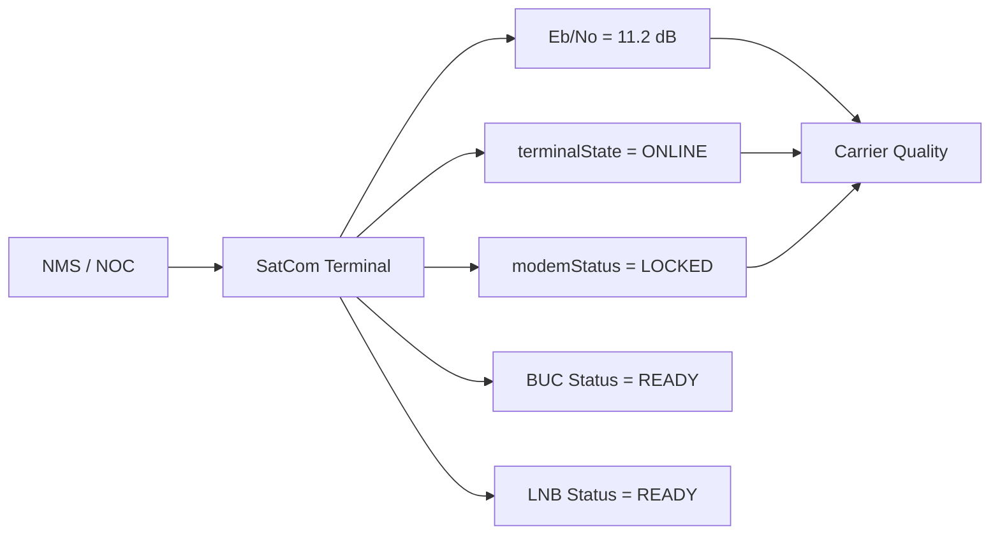

# SatCom OID Monitoring

```mermaid
graph LR
    nms[NMS / NOC] --> terminal[SatCom Terminal]
    terminal --> ebNo[Eb/No = 11.2 dB]
    terminal --> terminalState[terminalState = ONLINE]
    terminal --> modemStatus[modemStatus = LOCKED]
    terminal --> bucStatus[BUC Status = READY]
    terminal --> lnbStatus[LNB Status = READY]
    ebNo --> link[Carrier Quality]
    terminalState --> link
    modemStatus --> link
```
