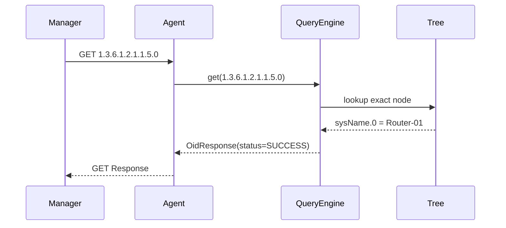

# SNMP GET Sequence

```mermaid
sequenceDiagram
    participant Manager
    participant Agent
    participant QueryEngine
    participant Tree

    Manager->>Agent: GET 1.3.6.1.2.1.1.5.0
    Agent->>QueryEngine: get(1.3.6.1.2.1.1.5.0)
    QueryEngine->>Tree: lookup exact node
    Tree-->>QueryEngine: sysName.0 = Router-01
    QueryEngine-->>Agent: OidResponse(status=SUCCESS)
    Agent-->>Manager: GET Response
```
