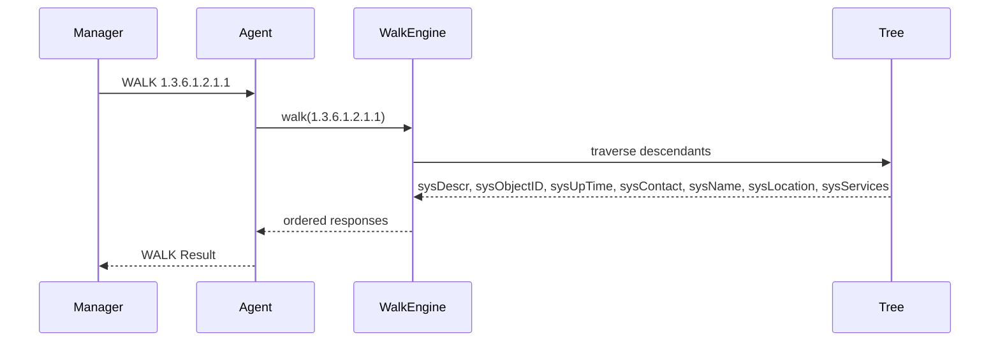

# SNMP WALK Sequence

```mermaid
sequenceDiagram
    participant Manager
    participant Agent
    participant WalkEngine
    participant Tree

    Manager->>Agent: WALK 1.3.6.1.2.1.1
    Agent->>WalkEngine: walk(1.3.6.1.2.1.1)
    WalkEngine->>Tree: traverse descendants
    Tree-->>WalkEngine: sysDescr, sysObjectID, sysUpTime, sysContact, sysName, sysLocation, sysServices
    WalkEngine-->>Agent: ordered responses
    Agent-->>Manager: WALK Result
```
