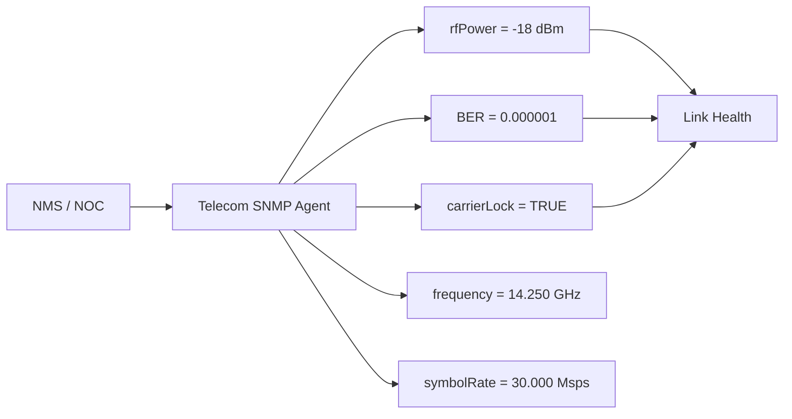

# Telecom OID Monitoring

```mermaid
graph LR
    nms[NMS / NOC] --> agent[Telecom SNMP Agent]
    agent --> rfPower[rfPower = -18 dBm]
    agent --> ber[BER = 0.000001]
    agent --> carrierLock[carrierLock = TRUE]
    agent --> frequency[frequency = 14.250 GHz]
    agent --> symbolRate[symbolRate = 30.000 Msps]
    rfPower --> status[Link Health]
    ber --> status
    carrierLock --> status
```
