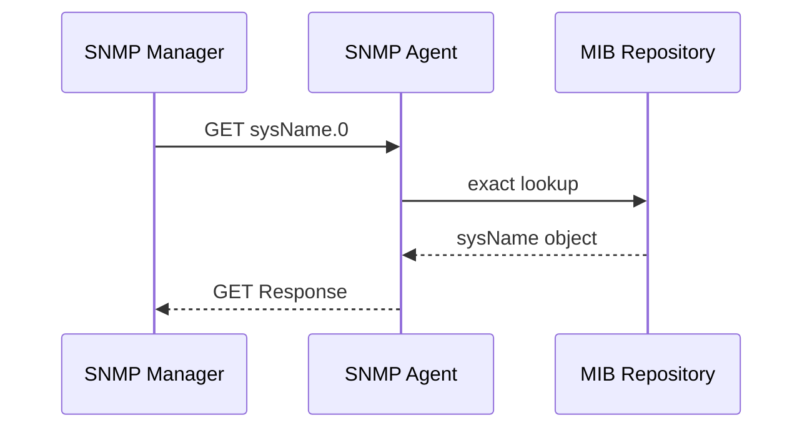

# GET Request Flow

```mermaid
sequenceDiagram
    participant Manager as SNMP Manager
    participant Agent as SNMP Agent
    participant MIB as MIB Repository

    Manager->>Agent: GET sysName.0
    Agent->>MIB: exact lookup
    MIB-->>Agent: sysName object
    Agent-->>Manager: GET Response
```
