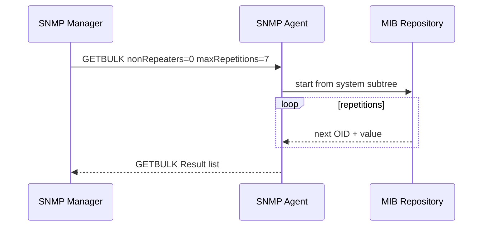

# GETBULK Retrieval

```mermaid
sequenceDiagram
    participant Manager as SNMP Manager
    participant Agent as SNMP Agent
    participant MIB as MIB Repository

    Manager->>Agent: GETBULK nonRepeaters=0 maxRepetitions=7
    Agent->>MIB: start from system subtree
    loop repetitions
        MIB-->>Agent: next OID + value
    end
    Agent-->>Manager: GETBULK Result list
```
