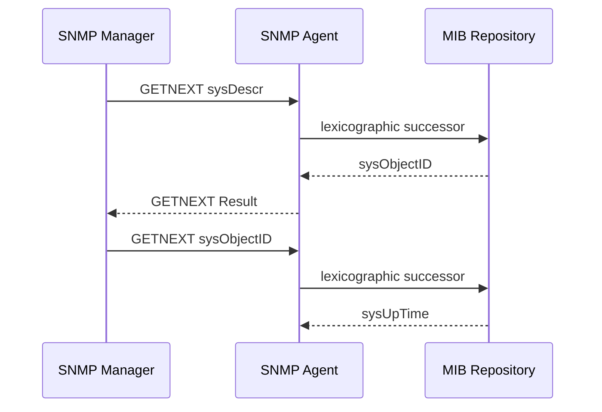

# GETNEXT Traversal

```mermaid
sequenceDiagram
    participant Manager as SNMP Manager
    participant Agent as SNMP Agent
    participant MIB as MIB Repository

    Manager->>Agent: GETNEXT sysDescr
    Agent->>MIB: lexicographic successor
    MIB-->>Agent: sysObjectID
    Agent-->>Manager: GETNEXT Result
    Manager->>Agent: GETNEXT sysObjectID
    Agent->>MIB: lexicographic successor
    MIB-->>Agent: sysUpTime
```
