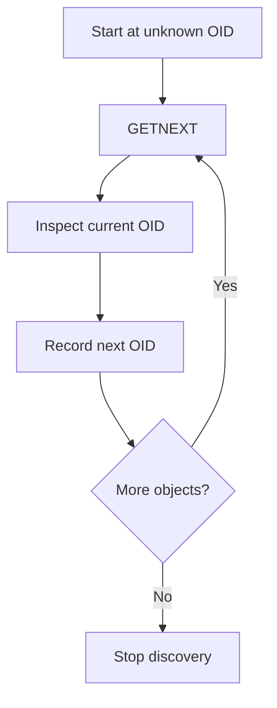

# OID Discovery Workflow

```mermaid
flowchart TD
    A[Start at unknown OID] --> B[GETNEXT]
    B --> C[Inspect current OID]
    C --> D[Record next OID]
    D --> E{More objects?}
    E -- Yes --> B
    E -- No --> F[Stop discovery]
```
