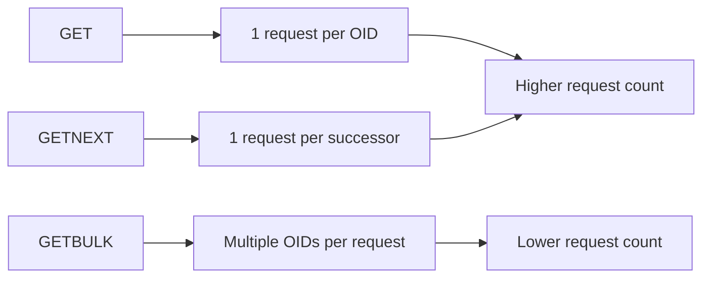

# Performance Comparison

```mermaid
flowchart LR
    A[GET] --> B[1 request per OID]
    C[GETNEXT] --> D[1 request per successor]
    E[GETBULK] --> F[Multiple OIDs per request]
    B --> G[Higher request count]
    D --> G
    F --> H[Lower request count]
```
