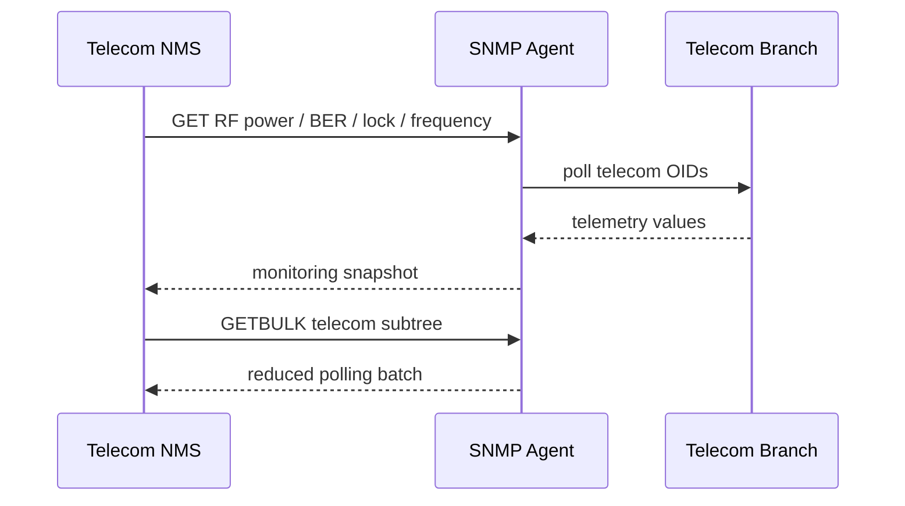

# Telecom Monitoring Flow

```mermaid
sequenceDiagram
    participant NMS as Telecom NMS
    participant Agent as SNMP Agent
    participant MIB as Telecom Branch

    NMS->>Agent: GET RF power / BER / lock / frequency
    Agent->>MIB: poll telecom OIDs
    MIB-->>Agent: telemetry values
    Agent-->>NMS: monitoring snapshot
    NMS->>Agent: GETBULK telecom subtree
    Agent-->>NMS: reduced polling batch
```
